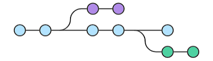

## Brief

### Preparation

Familiarize with GitFlow, GitHub Flow and Trunk Base Development. Git CLI commands will be used in this lesson.

### Lesson Overview

This lesson aims to help learners understand the concepts of the common branching strategies and tell the differences between them. The lesson will also simulate GitHub flow where learners will be making changes to a code base and create pull request to the remote branch.

---

## Self-studies check-in:

**Q1: What is the difference between GitFlow and GitHub Flow?**

A: GitFlow uses `main` branch while GitHub flow uses `master` branch.

B: GitFlow uses `develop` branch while GitHub flow does not.

C: GitFlow uses HotFix branch while GitHub flow does not.

D: GitFlow uses pull request while GitHub flow does not.

**Q2: Trunk Based Development do not use feature or hotfix branches.**

A: True

B: False

---
## Part 1 - What is a branching strategy?

In modern software development, speed and agility are crucial when it comes to developing and releasing software. In large development teams working simultaneously, branching and merging code can become messy. Hence, there is a need to have a process in place to implement multiple changes at once. This is where having an efficient branching strategy becomes a priority for these teams.

A branching strategy is the strategy that software development teams adopt when writing, merging and deploying code when using a version control system.

Branches are used as a means for teams to develop features giving them a separate workspace for their code. These branches are usually merged back to the main branch upon completion of work.



In this way, features (and any bug and bug fixes) are kept apart from each other allowing you to fix mistakes more easily.
This means that branches protect the mainline of code and any changes made to any given branch don’t affect other developers.

Benefits of branching strategies:
- Enhance productivity by ensuring proper coordination among developers
- Enable parallel development
- Help organize a series of planned, structured releases
- Map a clear path when making changes to software through to production
- Maintain a bug-free code where developers can quickly fix issues and get these changes back to production without disrupting the development workflow

There are different branching strategies, and the most commonly used are the following:
- GitFlow
- GitHub Flow
- Trunk Based Development

---

## Part 2 - GitFlow vs GitHub Flow vs Trunk Based Development

### GitFlow

Gitflow is an alternative Git branching model that involves the use of feature branches and multiple primary branches. 

Gitflow has numerous, longer-lived branches and larger commits. Under this model, developers create a feature branch and delay merging it to the main trunk branch until the feature is complete.

Gitflow can be used for projects that have a scheduled release cycle and for the DevOps best practice of continuous delivery. 

Branches:
1. Main branch - Stores the official release history.
2. Develop branch - Serves as an integration branch for features.
3. Feature branch - Each new feature should reside in its own branch. Feature branches use `develop` as their parent branch instead of `main`. When a feature is complete, it gets merged back into `develop`. Features should never interact directly with `main`.
4. Release branch - Created once the `develop` branch has enough features for a release or a release date is approaching. No new features can be added after this point—only bug fixes, documentation generation, and other release-oriented tasks should go in this branch.

Once it's ready to ship, the `release` branch gets merged into `main` and tagged with a version number. In addition, it should be merged back into `develop`, which may have progressed since the release was initiated.

How to do GitFlow
1. Start development by branching out a `feature` branch from the `develop` branch
1. Complete and test new feature in the `feature` branch
1. Merge `develop` branch into the `feature` branch to solve potential conflicts
1. Create a pull request from the `feature` branch to the `main` branch
1. Create a `release` branch from the `develop` branch
1. Perform fixes on `release` branch
1. Once stable, merge `release` branch into the `main` branch
1. Merge `main` branch into `develop` branch to kickstart new features


### GitHub Flow

Github Flow is a simpler alternative to GitFlow ideal for smaller teams as they don’t need to manage multiple versions and it is ideal when there is a need to maintain a single production version.

Unlike GitFlow, it doesn't have any `develop` and `release` branches. The team start off with the `main` branch then developers create `feature` branches that stem directly from `main`, to isolate their work which are then merged back into `main`. The feature branch is then deleted.

Branches:
1. Main branch - Contains code that is always deployable.
2. Feature branch - Each new feature should reside in its own branch. Feature branches branch out from `main`. When a feature is complete, it gets merged back into `main`.

> Do everything without a `develop` and `release` branch.
1. Start development by branching out a `feature` branch from the `main` branch
1. Complete and test new feature in the `feature` branch
1. Create a pull request from the `feature` branch to the `main` branch
1. Merge `feature` branch into the `main` branch to solve potential conflicts


### Trunk Based Development

Trunk-based development is a branching strategy wherein developers merge small, frequent updates to a core "trunk" or main branch. It helps CI/CD by streamlining merging and integration phases.

Developers can create short-lived branches with a few small commits compared to other long-lived feature branching strategies.

> All developments must be small batch iterations and is directly pushed into the `main` (trunk) branch. 

Trunk Based:


Non-trunk Based:


---

## Part 3 - Case Study

Learners are given with a few scenarios. In a group of 3, the team is expected to suggest one branching strategy that is most applicable to the scenario and justify it by explaining the "why". Include any other assumptions that influence your team's decision.

After discussing the scenario, end with the final question posted at the end of this section.

---
### Scenario One - A Utility Mobile App

The utility app is a paid app. The team has received multiple feedbacks from the public about feature request and bug fixes. The team has produced a priority list to work on them. The priority of the feature releases have been frequently encountered changes. Such as, a feature might be planned to release in version 1.2.1, may be disrupted and change to a later release at times.

```
Your answer here
```

---
### Scenario Two - A Market Penetrating Product

A tech product company is planning to penetrate the market with their tech product developed in-house. They have spent money on marketing and advertisement, exciting the public users in anticipating the next release. There are also sales and account personnel meeting with potential customers to give demo. Not all latest features are included in the demo. 

```
Your answer here
```

---

### Scenario Three - A System Integration Project

At a system integrator company, the team received an A-Z requirements from a customer that has recently been signed off. There is a fixed set of requirements, timeline, and given manpower to complete the project.

```
Your answer here
```

---
Final Question: How these branching strategies affect DevOps?
```
Your answer here
```
---

## Part 4 - Simulate a GitHub Flow

In this section, we will simulate a simplified GitHub flow using [this](https://github.com/su-ntu-ctp/6m-software-4.2-lesson-exercise) sample repository.

Step 1: Fork the repository

Step 2: Create a new branch `Feature-<your initial>-test` (the goal is ensuring all branches are unique).

Step 3: Clone the forked repository to your local machine

```sh
git clone <url>
```

Step 4: Check out your branch locally
```sh
git checkout <branch name>
```

Step 5: Edit the `readme.md` file

Step 6: Add, commit and push changes to the forked repository
```
git add .
git commit -m "type a meaningful message here"
git push origin <branch name>
```

Step 7: Go to `https://github.com/your_username/6m-software-4.2-lesson-exercise` to create a Pull Request from your branch to the `main` branch of `https://github.com/su-ntu-ctp/6m-software-4.2-lesson-exercise`.

Step 8: Instructor to demonstrate merging the pull request into the `main` branch.
